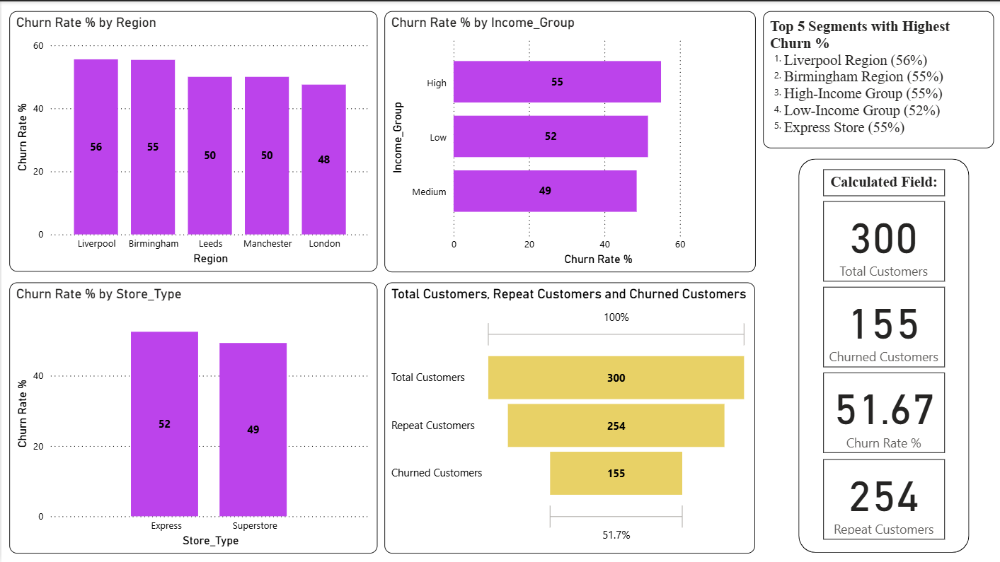
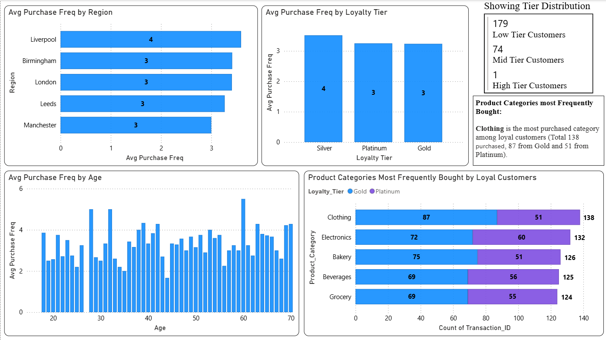
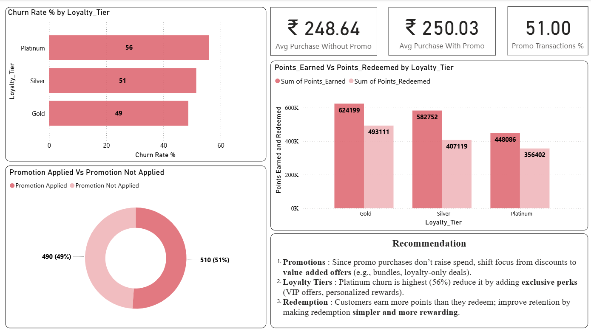
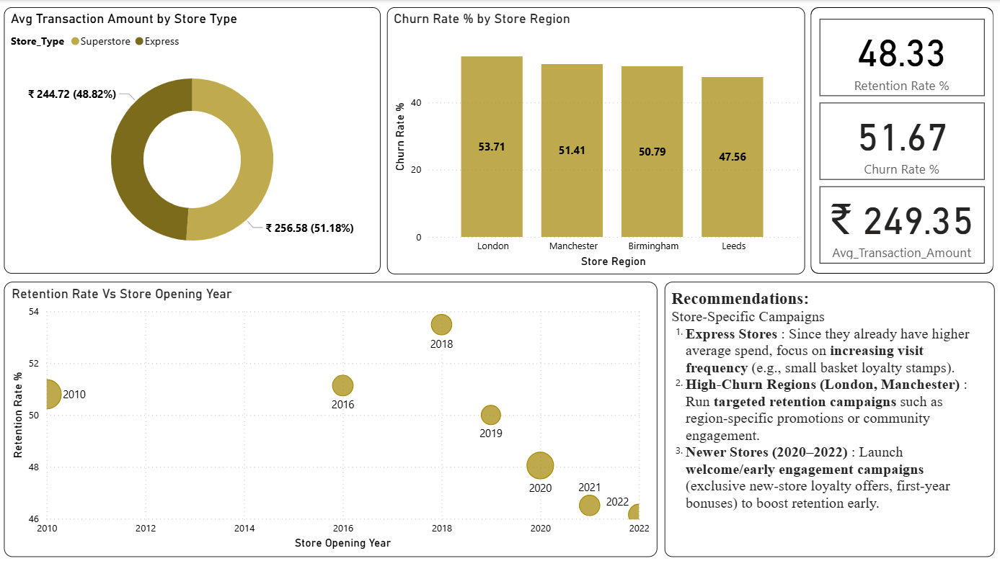
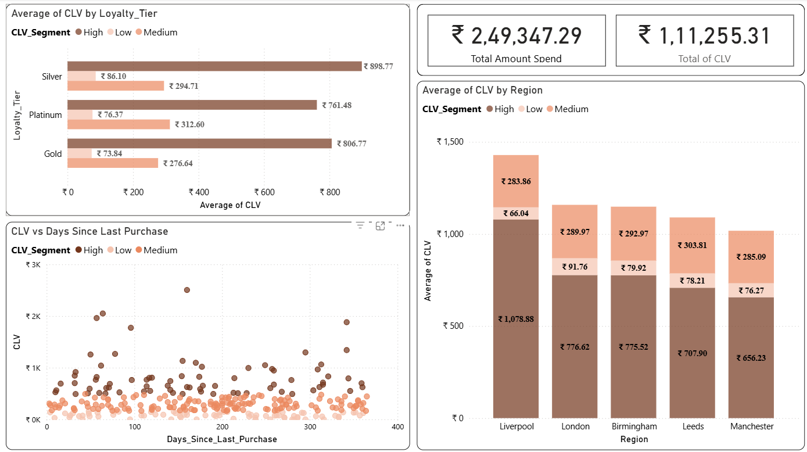
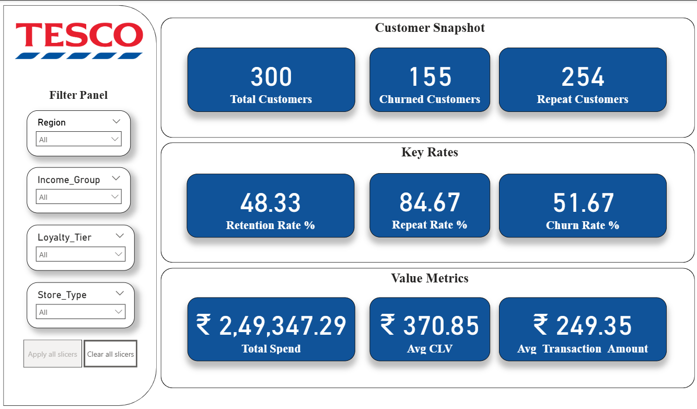
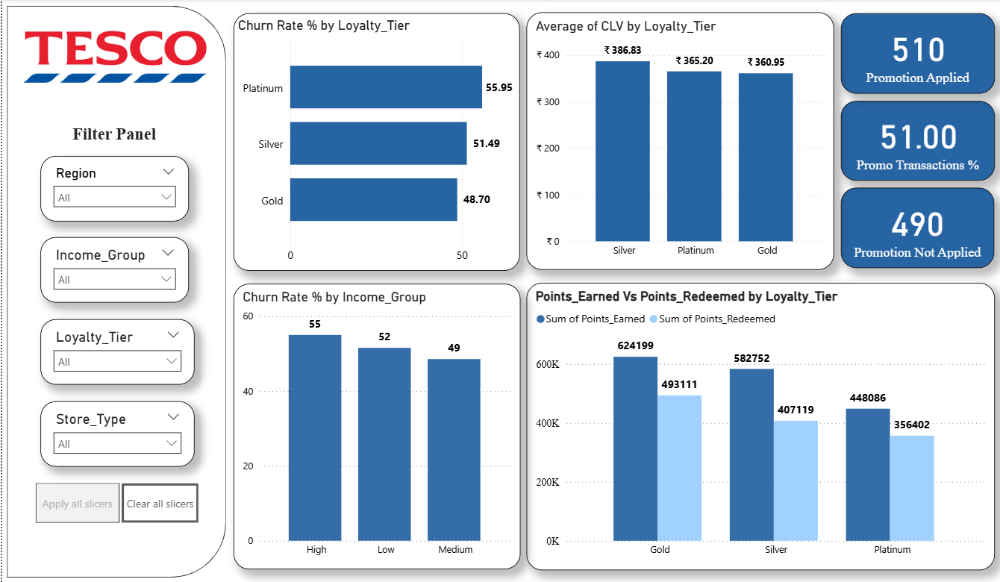
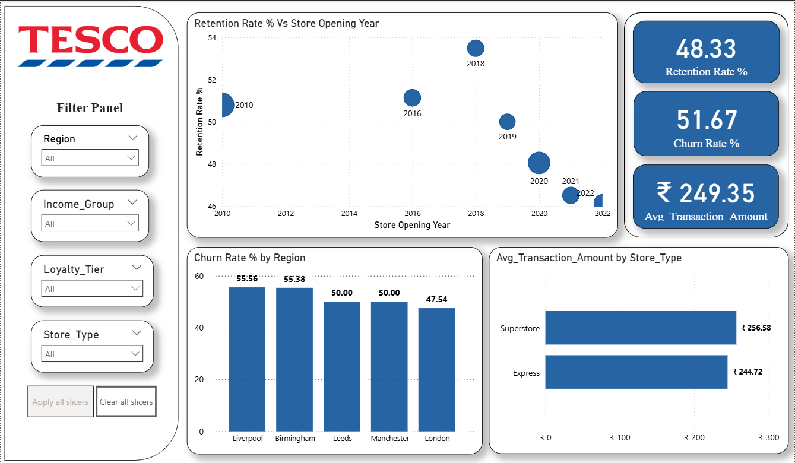
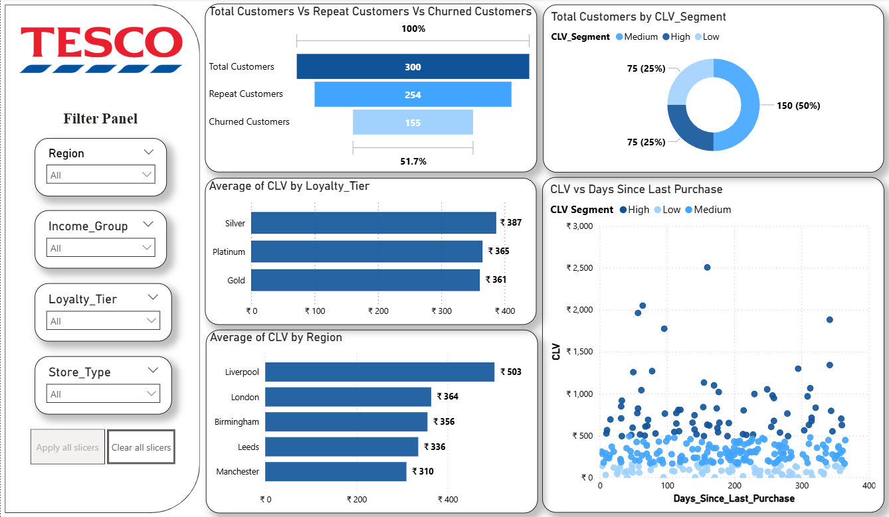

# TESCO-Customer-Retention-Analytics-By-Power-BI-Dashboard
### Project Provided by: **Internshala Data Science Training Program**  
### Project Explanation Video: [▶ Watch Here](https://drive.google.com/file/d/1krrqdZtEW2qPGIEjFuE0DdsibloFRkSK/view?usp=sharing)

---

## **Project Overview**

This project - **TESCO Customer Retention Analytics**  aims to analyze customer churn, loyalty behavior, and lifetime value using **Microsoft Power BI**.  
It enables **TESCO**, a leading retail company, to identify key drivers of churn, evaluate promotional effectiveness, and improve customer retention strategies.  

The analysis integrates data from multiple sources, applies advanced DAX measures, and visualizes insights through an interactive multi-page Power BI dashboard designed for executive decision-making.

---

## **Project Objectives**

1. Analyze **churn and retention trends** across demographics, regions, and store types.  
2. Evaluate **loyalty programs** and **promotion effectiveness**.  
3. Calculate and segment customers by **Customer Lifetime Value (CLV)**.  
4. Assess **store and regional performance** to guide marketing focus.  
5. Create a professional, **interactive Power BI dashboard** with executive-level insights.  

---

## **Datasets Used**

This project uses **five interlinked datasets** provided by *Internshala*:  

| Dataset Name | Description |
|---------------|-------------|
| **Customer_Demographics.csv** | Customer details such as age, gender, income group, marital status, region, and membership details. |
| **Customer_Transactions.csv** | Historical transaction records including purchase amounts, categories, and dates. |
| **Loyalty_Program.csv** | Loyalty tier details, points earned/redeemed, and membership benefits. |
| **Store_Locations.csv** | Store information including type, region, and opening year. |
| **Churn_Labelled_Customers.csv** | Contains churned vs retained customer labels for churn analysis. |

Each dataset was cleaned, transformed, and linked using primary relationships (Customer_ID, Store_ID).

---

## **Task-Wise Analysis and Insights**

---

### **Task 1: Data Modelling and Preparation**

- Connected all five datasets using key relationships.  
- Cleaned missing and duplicate records.  
- Created calculated columns:  
  - `Membership_Duration` (days and years)  
  - `Purchase_Count`  
- Built a **data model** optimized for DAX calculations.  

**Insight:**  
A robust data foundation was built to ensure accurate measures and visual consistency across all reports.

---

### **Task 2: Churn & Retention Analysis**

- Calculated KPIs:  
  - **Total Customers**, **Churned Customers**, **Repeat Customers**, **Churn Rate %**, **Retention Rate %**  
- Visualized churn by **Region**, **Income Group**, and **Store Type**.  
- Added a table for the **Top 5 Segments with Highest Churn**.

**Task 2 – Churn & Retention Dashboard**  

**Insights:**  
- Liverpool and Birmingham had the **highest churn (55%)**.  
- High-income customers churn more, suggesting loyalty issues among premium shoppers.  
- Overall churn rate: **51.67%**.

---

### **Task 3: Repeat Purchase Analysis**

- Analyzed **Average Purchase Frequency** by **Region**, **Age**, and **Loyalty Tier**.  
- Added visuals for **Top Product Categories** most purchased by loyal customers.  

**STask 3 – Repeat Purchase Dashboard**  

**Insights:**  
- **Silver-tier** customers shop the most frequently.  
- **Clothing** is the most purchased category (138 total transactions).  
- Older age groups show slightly higher purchase frequency consistency.

---

### **Task 4: Loyalty & Promotion Impact**

- Compared **Average Purchase Amount** with and without promotions.  
- Measured **Promo Transactions %** (51%).  
- Compared **Points Earned vs Points Redeemed** per loyalty tier.  
- Visualized **Churn Rate by Loyalty Tier**.

**Task 4 – Loyalty & Promotion Impact Dashboard**  

**Insights:**  
- **Platinum customers** churn the most (56%).  
- Customers earn more points than they redeem → underutilized loyalty benefits.  
- Promotions slightly increased purchase frequency but not overall spend.  

**Recommendation:**  
Offer more **value-added promotions** instead of frequent discounts, and simplify **reward redemption**.

---

### **Task 5: Store Performance Analysis**

- Analyzed **Churn Rate by Region**, **Average Transaction Amount by Store Type**, and **Retention Rate by Store Opening Year**.  
- Added bubble charts and key metrics for store insights.  

**Task 5 – Store Performance Dashboard**  

**Insights:**  
- **Express Stores** have slightly higher average transaction values.  
- **Newer stores (2020–2022)** show **lower retention**, requiring stronger onboarding campaigns.  
- **London and Manchester** exhibit moderate churn — key targets for regional campaigns.

---

### **Task 6: Customer Lifetime Value (CLV) Analysis**

- Calculated **CLV = Total Spend / Membership Duration (in Years)**.  
- Segmented customers into **Low**, **Medium**, and **High CLV** categories.  
- Created visuals to show **CLV by Region** and **Loyalty Tier**.  
- Scatter plot to compare **CLV vs Days Since Last Purchase**.  

**Task 6 – CLV Analysis Dashboard**  

**Insights:**  
- **Liverpool region** and **Silver-tier** customers have the **highest CLV**.  
- Most customers fall under **medium CLV**, showing potential for long-term retention strategies.

---

### **Task 7: Final Executive Dashboard**

Created a professional **multi-page Power BI report** combining all analysis results.

**Dashboard Pages:**
1. **Overview KPIs** – Business summary (Churn %, Retention %, CLV, Total Spend).

  
2. **Loyalty & Promotion Impact** – Effectiveness of promotions and loyalty tiers.  

3. **Store & Region Insights** – Regional and store-level performance metrics.  

4. **Customer Segmentation** – CLV-based segmentation with behavioral visuals.  

---

## **Top Recommendations & Next Focus Areas**

### **1️ Improve Loyalty Effectiveness**
- Platinum-tier customers have high churn despite high value.  
- Introduce **exclusive loyalty benefits** and **VIP experiences** to retain top spenders.

### **2️ Simplify Reward Redemption**
- Only -80% of earned points are redeemed.  
- Make the process easier and highlight available rewards in-store and online.

### **3️ Strengthen New Store Retention**
- Stores opened post-2020 show low retention.  
- Launch **welcome offers** and **early engagement programs** (e.g., bonus points, first-purchase perks).

### **4️ Focus Regions: Liverpool & Birmingham**
- These cities consistently show the highest churn.  
- Run **region-specific retention campaigns** and community engagement drives.

---

## **Tools and Techniques Used**

| Category | Tools / Concepts |
|-----------|------------------|
| **Data Preparation** | Microsoft Excel |
| **Data Visualization** | Microsoft Power BI |
| **Modeling** | Star Schema Data Model |
| **DAX Measures** | Churn Rate %, Retention Rate %, CLV, Avg Transaction Amount |
| **Dashboard Features** | Interactive Slicers (Region, Income Group, Loyalty Tier, Store Type), Dark Theme Layout |
| **Visualization Types** | KPI Cards, Bar/Column Charts, Donut Chart, Scatter Plot, Bubble Chart |

---
